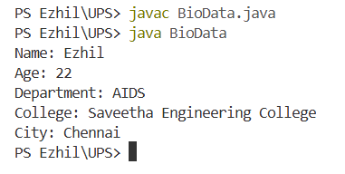
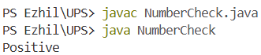
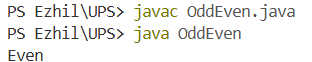

# UPS Training – Day 2

## Topics Covered

### JVM, JRE and JDK
* **JVM (Java Virtual Machine):** Executes Java bytecode.
* **JRE (Java Runtime Environment):** JVM + Environment + Libraries
* **JDK (Java Development Kit):** JRE + Developer Tools + Compiler

---

### Java Compilation Flow

```text
Source Code (.java)
        ↓
      javac
        ↓
Bytecode (.class)
        ↓
       JVM
        ↓
Machine Code
```

---

### Java Primitive Data Types

| Data Type | Size |
| :--- | :--- |
| `boolean` | 1 bit* |
| `byte` | 1 byte |
| `short` | 2 bytes |
| `char` | 2 bytes |
| `int` | 4 bytes |
| `float` | 4 bytes |
| `long` | 8 bytes |
| `double` | 8 bytes |

*\* `boolean` does not have a precisely specified storage size in Java; 1 bit is commonly used for basic teaching.*

---

# Java Operators

| Operator Type | Operators | Operands |
| :--- | :--- | :--- |
| Arithmetic | `+`, `-`, `*`, `/`, `%` | 2 |
| Assignment | `=`, `+=`, `-=`, `*=`, `/=`, `%=` | 2 |
| Relational / Comparison | `==`, `!=`, `>`, `<`, `>=`, `<=` | 2 |
| Logical | `&&`, `\|\|`, `!` | 2 (for `&&`, `\|\|`), 1 (for `!`) |
| Unary | `++`, `--`, `+`, `-`, `!` | 1 |
| Ternary | `? :` | 3 |

> **Note:** Comparison expressions follow the standard convention:
> 
> $$\text{Dynamic Value (Left)} \longrightarrow \text{Comparison Operator} \longrightarrow \text{Fixed Value (Right)}$$
> 
> *Example:* `age >= 18` or `num % 2 == 0`

---

## Tasks

### Task 1 – Bio Data
```java
class BioData {
    public static void main(String[] args) {
        String name = "Ezhil";
        int age = 22;
        String department = "AIDS";
        String college = "Saveetha Engineering College";
        String city = "Chennai";

        System.out.println("Name: " + name);
        System.out.println("Age: " + age);
        System.out.println("Department: " + department);
        System.out.println("College: " + college);
        System.out.println("City: " + city);
    }
}
```
**Output:**



### Task 2 – Positive or Negative
```java
class NumberCheck {
    public static void main(String[] args) {
        int num = 10;

        System.out.println(num % 2 == 0 ? "Positive" : "Negative");
    }
}
```

**Output:**



### Task 3 – Odd or Even
```java
class OddEven {
    public static void main(String[] args) {
        int num = 10;

        System.out.println(num % 2 == 0 ? "Even" : "Odd");
    }
}
```
**Output:**

