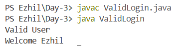
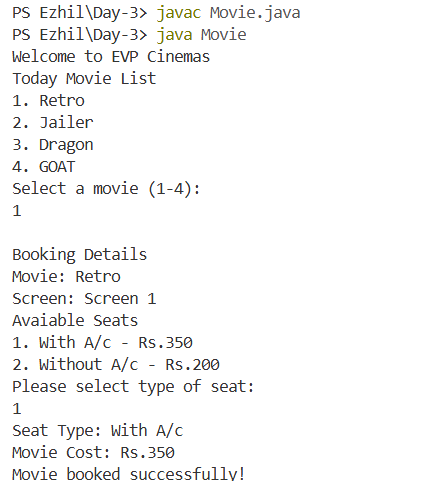
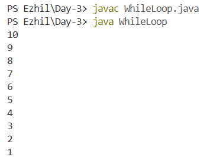
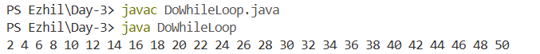
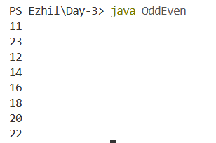
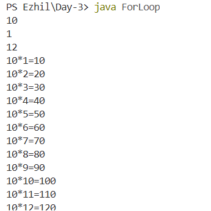
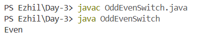
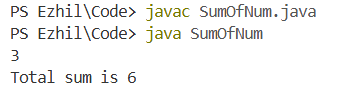
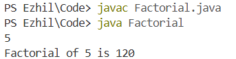
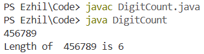

# UPS Training – Day 3

Day 3 focused on conditional statements, loops, switch statements, user input handling, and practical Java implementation tasks.

---

## Topics Covered

* `if` statement
* Nested `if`
* `if-else`
* `if-else if-else` ladder
* `switch` statement
* `while` loop
* `do-while` loop
* `for` loop
* `break` statement
* `Scanner` class for console input
* String comparison using `.equals()`

---

## Tasks

### Task 1 – Valid Login

```java
class ValidLogin {
    public static void main(String[] args) {
        String username = "Ezhil";
        String password = "12345";

        if (username.equals("Ezhil")) {
            System.out.println("Valid User");

            if (password.equals("12345")) {
                System.out.println("Welcome " + username);
            } else {
                System.out.println("Please Enter Valid password");
            }
        } else {
            System.out.println("Please Enter valid username");
        }
    }
}
```

**Output:**



---

### Task 2 – Movie Booking System

```java
import java.util.Scanner;

class Movie {
    public static void main(String[] args) {
        Scanner sc = new Scanner(System.in);

        System.out.println("Welcome to EVP Cinemas");

        while (true) {
            System.out.println("\nToday Movie List");
            System.out.println("1. Retro");
            System.out.println("2. Jailer");
            System.out.println("3. Dragon");
            System.out.println("4. GOAT");
            System.out.print("Select a movie (1-4): ");

            int movie = sc.nextInt();

            if (movie == 0) {
                System.out.println("Thank you for visiting EVP Cinemas.");
                break;
            }

            String movieName = "";
            String screen = "";

            switch (movie) {
                case 1:
                    movieName = "Retro";
                    screen = "Screen 1";
                    break;
                case 2:
                    movieName = "Jailer";
                    screen = "Screen 2";
                    break;
                case 3:
                    movieName = "Dragon";
                    screen = "Screen 3";
                    break;
                case 4:
                    movieName = "GOAT";
                    screen = "Screen 4";
                    break;
                default:
                    System.out.println("Invalid movie selection!");
                    continue;
            }

            System.out.println("\nBooking Details");
            System.out.println("Movie: " + movieName);
            System.out.println("Screen: " + screen);

            System.out.println("\nAvailable Seats");
            System.out.println("1. With A/c - Rs.350");
            System.out.println("2. Without A/c - Rs.200");
            System.out.print("Please select type of seat: ");

            int seat = sc.nextInt();

            if (seat == 1) {
                System.out.println("Seat Type: With A/c");
                System.out.println("Movie Cost: Rs.350");
                System.out.println("Movie booked successfully!");
            } else if (seat == 2) {
                System.out.println("Seat Type: Without A/c");
                System.out.println("Movie Cost: Rs.200");
                System.out.println("Movie booked successfully!");
            } else {
                System.out.println("Invalid seat selection!");
            }
        }
        sc.close();
    }
}
```
**Output:**



---

### Task 3 – Print 10 to 1 Using While Loop

```java
public class WhileLoop {
    public static void main(String[] args) {
        int num = 10;

        while (num >= 1) {
            System.out.println(num);
            num--;
        }
    }
}
```

**Output:**



---

### Task 4 – Print Even Numbers from 1 to 50 Using Do-While

```java
class DoWhileLoop {
    public static void main(String[] args) {
        int num = 2;

        do {
            System.out.print(num+" ");
            num += 2;
        } while (num <= 50);
    }
}
```
**Output:**



---

### Task 5 – Print Even Numbers Between Two Given Numbers

```java
import java.util.Scanner;

class OddEven {
    public static void main(String[] args) {
        Scanner sc = new Scanner(System.in);

        int start = sc.nextInt();
        int end = sc.nextInt();

        if (start % 2 != 0) {
            start += 1;
        }

        while (start <= end) {
            System.out.println(start);
            start += 2;
        }
        
        sc.close();
    }
}
```
**Output:**



---

### Task 6 – Multiplication Table Using For Loop

```java
import java.util.Scanner;

public class ForLoop {
    public static void main(String[] args) {
        Scanner sc = new Scanner(System.in);

        int table = sc.nextInt();
        int start = sc.nextInt();
        int end = sc.nextInt();

        for (int i = start; i <= end; i++) {
            System.out.println(table + "*" + i + "=" + (table * i));
        }

        sc.close();
    }
}
```
**Output:**



---

### Task 7 – Odd or Even Using Switch Statement

*Odd or even determination implemented without conditional branching (`if-else`) or the ternary operator.*

```java
class OddEvenSwitch {
    public static void main(String[] args) {
        int num = 10;
        int rem = num % 2;

        switch (rem) {
            case 0:
                System.out.println("Even");
                break;
            default:
                System.out.println("Odd");
        }
    }
}
```

**Output:**



---

### Task 8 – Sum of First N Natural Numbers

```java
import java.util.Scanner;

public class SumOfNum {
    public static void main(String[] args) {
        Scanner sc = new Scanner(System.in);
        int n = sc.nextInt();
        int sum = 0;

        for (int i = 1; i <= n; i++) {
            sum += i;
        }

        System.out.println("Total sum is " + sum);
        sc.close();
    }
}
```

**Output:**



---

### Task 9 – Factorial of a Number

```java
import java.util.Scanner;

public class Factorial {
    public static void main(String[] args) {
        Scanner sc = new Scanner(System.in);
        int n = sc.nextInt();
        long fact = 1;

        for (int i = 1; i <= n; i++) {
            fact *= i;
        }

        System.out.println("Factorial of " + n + " is " + fact);
        sc.close();
    }
}
```

**Output:**



---

### Task 10 – Count Number of Digits in an Integer

```java
import java.util.Scanner;
public class DigitCount {
    public static void main(String[] args) {
        
        Scanner sc = new Scanner(System.in);
        int num = sc.nextInt();
        int original=num;
        int count=0;
        while(num>0){
            num/=10;
            count++;
        }
        System.out.println("Length of  "+original+" is "+count);
    }
}

```

**Output:**



---

## Architectural Flow

```text
Conditional Statements
        ↓
if → if-else → nested if → else-if

Selection
        ↓
switch-case

Loops
        ↓
while → do-while → for
```

---