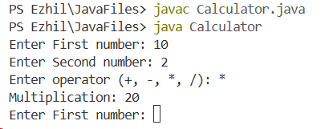
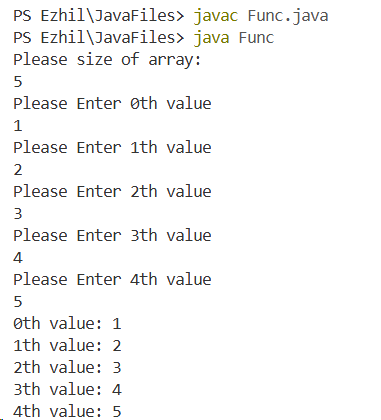
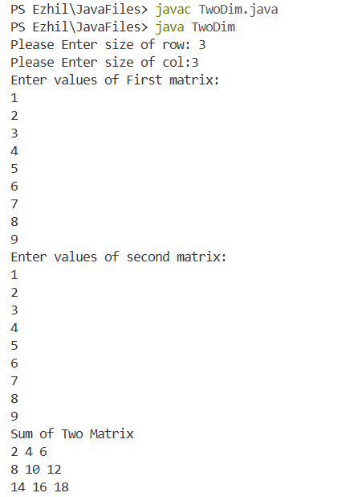
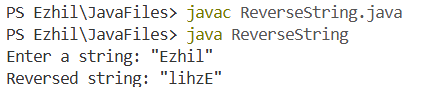
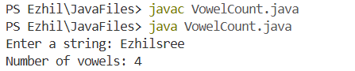
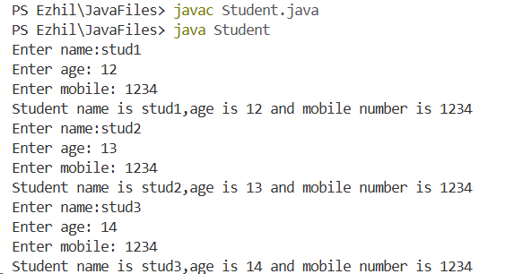
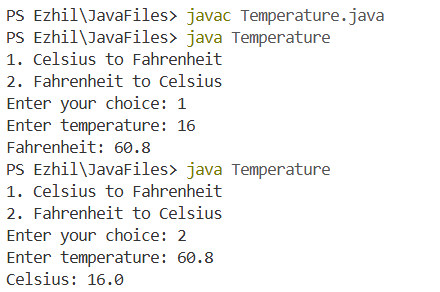

# UPS Training – Day 4

## Topics Covered
- Methods in Java
  - Static methods
  - Methods with parameters
  - Method calling
- Arrays in Java
  - Array declaration and initialization
  - Accessing array elements
  - Iterating through arrays
- Type Casting in Java
  - Implicit type casting (Widening)
  - Explicit type casting (Narrowing)

## Task 1 – Calculator Using Methods and Looping

```java
import java.util.*;

class Calculator {

    static void add(int a, int b) {
        System.out.println("Addition: " + (a + b));
    }

    static void sub(int a, int b) {
        System.out.println("Subtraction: " + (a - b));
    }

    static void mul(int a, int b) {
        System.out.println("Multiplication: " + (a * b));
    }

    static void div(int a, int b) {
        if (b != 0)
            System.out.println("Division: " + (a / b));
        else
            System.out.println("Cannot divide by zero");
    }

    public static void main(String[] args) {
        Scanner sc = new Scanner(System.in);

        while (true) {
            System.out.print("Enter First number: ");
            int a = sc.nextInt();

            System.out.print("Enter Second number: ");
            int b = sc.nextInt();

            System.out.print("Enter operator (+, -, *, /): ");
            char op = sc.next().charAt(0);

            switch (op) {
                case '+':
                    add(a, b);
                    break;
                case '-':
                    sub(a, b);
                    break;
                case '*':
                    mul(a, b);
                    break;
                case '/':
                    div(a, b);
                    break;
                default:
                    System.out.println("Invalid operator");
            }
        }
    }
}
```
**Output:**



---

## Task 2-Create, Store, and Display Array Elements Using Loops

```java
import java.util.*;
public class Func {
public static void main(String[] args) {
    Scanner sc= new Scanner(System.in);
    System.out.println("Please size of array:");
    int n=sc.nextInt();
    int[] arr= new int[n];
    for(int i=0;i<n;i++){
        System.out.println("Please Enter "+i+"th value");
        arr[i]=sc.nextInt();
    }
    for(int i=0;i<n;i++){
        System.out.println(i+"th value: "+arr[i]);
    }
}
    
}
```
**Output:**



---
## Task 3-Addition of Two Matrices Using Methods and 2D Arrays
```java
import java.util.*;
public class TwoDim {
    static Scanner sc= new Scanner(System.in);
    static int[][] createArray(int row,int col){
        int[][] arr=new int[row][col];
        for(int i=0;i<row;i++){
            for(int j=0;j<col;j++){
                arr[i][j]=sc.nextInt();
            }
        }
        return arr;
    }
    static int[][] addMatrix(int row,int col,int[][] arr1,int[][] arr2){
        int[][] res=new int[row][col];
        for(int i=0;i<row;i++){
            for(int j=0;j<col;j++){
                res[i][j]=arr1[i][j]+arr2[i][j];
            }
        }
        return res;
    }
    public static void main(String[] args) {
        
        System.out.print("Please Enter size of row: ");
        int row=sc.nextInt();
        System.out.print("Please Enter size of col:");
        int col=sc.nextInt();
        System.out.println("Enter values of First matrix: ");
        int[][] arr1= createArray(row,col);
        System.out.println("Enter values of second matrix: ");
        int[][] arr2= createArray(row,col);
        int[][] res=addMatrix(row,col,arr1,arr2);
        System.out.println("Sum of Two Matrix");
        for(int i=0;i<row;i++){
            for(int j=0;j<col;j++){
                System.out.print(res[i][j]+" ");
            }
            System.out.println();
        }


        
    }
    
    
}


```


## Task 3 – Reverse a String
```java
import java.util.*;

public class ReverseString {
    public static void main(String[] args) {
        Scanner sc = new Scanner(System.in);

        System.out.print("Enter a string: ");
        String str = sc.nextLine();

        String rev = "";

        for (int i = str.length() - 1; i >= 0; i--) {
            rev += str.charAt(i);
        }

        System.out.println("Reversed string: " + rev);
    }
}
```
**output:**


---
## Task 4-Count Vowels in a String

```java
import java.util.*;

public class VowelCount {
    public static void main(String[] args) {
        Scanner sc = new Scanner(System.in);

        System.out.print("Enter a string: ");
        String str = sc.nextLine().toLowerCase();

        int count = 0;

        for (int i = 0; i < str.length(); i++) {
            char ch = str.charAt(i);

            if (ch == 'a' || ch == 'e' || ch == 'i' ||
                ch == 'o' || ch == 'u') {
                count++;
            }
        }

        System.out.println("Number of vowels: " + count);
    }
}
```
**Output:**



## Task 5-Student Information System Using Classes, Objects, and Methods
```java
import java.util.*;
class Student {
    Scanner sc= new Scanner(System.in);
    String name;
    int age;
    Long mobile;

    void createStudent(){
        System.out.print("Enter name:");
        name=sc.nextLine();
        System.out.print("Enter age: ");
        age = sc.nextInt();
        System.out.print("Enter mobile: ");
        mobile = sc.nextLong();
    }
    void display(){
        System.out.println("Student name is "+name + ",age is " + age + " and mobile number is " + mobile);
    }
}

public class StudentInfo{
    public static void main(String[] args) {
        Student s1 = new Student();
        Student s2 = new Student();
        Student s3 = new Student();

        s1.createStudent();
        s1.display();

        s2.createStudent();
        s2.display();

        s3.createStudent();
        s3.display();
    }
}
```
**Output:**



## Task 6-Temperature Conversion (Celsius to Fahrenheit and Fahrenheit to Celsius)
```java
import java.util.*;

public class Temperature {
    static double celsiusToFahrenheit(double c) {
        return (c * 9 / 5) + 32;
    }

    static double fahrenheitToCelsius(double f) {
        return (f - 32) * 5 / 9;
    }

    public static void main(String[] args) {
        Scanner sc = new Scanner(System.in);

        System.out.println("1. Celsius to Fahrenheit");
        System.out.println("2. Fahrenheit to Celsius");
        System.out.print("Enter your choice: ");
        int choice = sc.nextInt();

        System.out.print("Enter temperature: ");
        double temp = sc.nextDouble();

        switch (choice) {
            case 1:
                System.out.println("Fahrenheit: " + celsiusToFahrenheit(temp));
                break;
            case 2:
                System.out.println("Celsius: " + fahrenheitToCelsius(temp));
                break;
            default:
                System.out.println("Invalid choice");
        }

        sc.close();
    }
}
```
**Output:**

